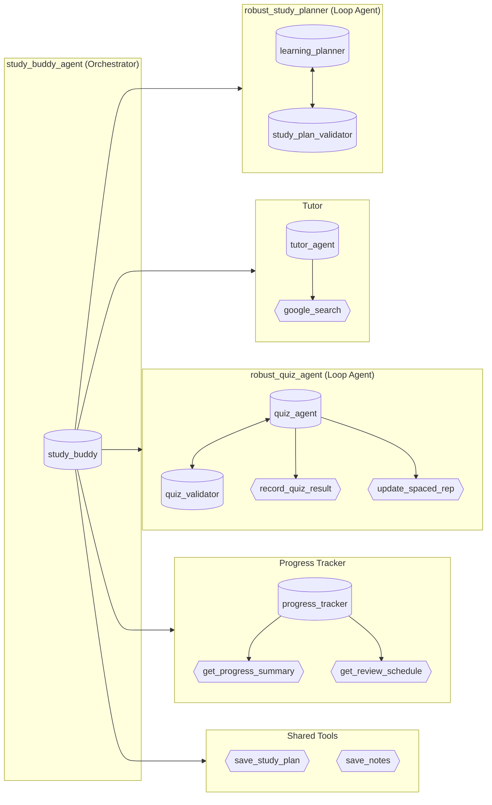

# StudyBuddy — Architecture Overview

## System Design

StudyBuddy follows a **hub-and-spoke multi-agent pattern**. A single orchestrator (`study_buddy_agent`) receives every user message and delegates to the most appropriate specialist agent via Google ADK's `AgentTool` abstraction. The orchestrator's system prompt contains an explicit routing table so the LLM can map intent to the correct sub-agent.

### Key architectural decisions

| Decision | Rationale |
|---|---|
| `AgentTool` wrapping | Agents appear as callable tools to the orchestrator — no custom dispatcher logic needed; the LLM handles routing naturally via function-calling |
| Loop Agents for QA | Validator micro-agents retry generation until output passes a quality gate (`"VALID"` / `"INVALID: …"`), preventing low-quality responses from reaching the user |
| Dual persistence | ADK `InMemorySessionService` for in-flight state + custom JSON file store for cross-session recall — keeps the system stateless-safe while supporting long-term progress tracking |
| Single model throughout | `gemini-2.0-flash` for all agents — reduces latency and simplifies deployment |
| No database | JSON files suffice for a single-user prototype; the schema is defined in `profile_schema.json` for future migration |

---

## Agent Hierarchy — Mermaid Diagram

> Renders natively on GitHub. Open this file in the GitHub web UI to see the interactive diagram.



---

## ASCII Diagram

```
                    ┌─────────────────────────────────────────────────────────┐
                    │           robust_study_planner (Loop Agent)             │
                    │  ┌─────────────────┐      ┌──────────────────────────┐  │
                    │  │ learning_planner │◄────►│ study_plan_validator     │  │
                    │  └─────────────────┘      └──────────────────────────┘  │
                    └─────────────────────────────────────────────────────────┘
                                              ▲
                                              │
                    ┌─────────────────────────────────────────────────────────┐
                    │                    tutor_agent                          │
                    │  ┌─────────────────┐      ┌──────────────────────────┐  │
                    │  │   tutor_agent   │─────►│     google_search        │  │
                    │  └─────────────────┘      └──────────────────────────┘  │
                    └─────────────────────────────────────────────────────────┘
                                              ▲
                                              │
┌──────────────────────┐                      │
│                      │──────────────────────┤
│  study_buddy_agent   │                      │
│    (Orchestrator)    │──────────────────────┤
│                      │                      │
└──────────────────────┘                      │
          │                                   ▼
          │           ┌─────────────────────────────────────────────────────────┐
          │           │             robust_quiz_agent (Loop Agent)              │
          │           │  ┌─────────────────┐      ┌──────────────────────────┐  │
          │           │  │   quiz_agent    │◄────►│    quiz_validator        │  │
          │           │  └────────┬────────┘      └──────────────────────────┘  │
          │           │           │                                             │
          │           │           ├──► record_quiz_result                       │
          │           │           └──► update_spaced_repetition                 │
          │           └─────────────────────────────────────────────────────────┘
          │
          │           ┌─────────────────────────────────────────────────────────┐
          │           │                  progress_tracker                       │
          │           │  ┌─────────────────┐                                    │
          └──────────►│  │progress_tracker │──► get_progress_summary            │
                      │  └─────────────────┘──► get_review_schedule             │
                      └─────────────────────────────────────────────────────────┘
          │
          │           ┌─────────────────────────────────────────────────────────┐
          └──────────►│                      Tools                              │
                      │     save_study_plan_to_file    save_notes_to_file       │
                      └─────────────────────────────────────────────────────────┘
```

---

## Data Flow

1. **User message** enters via `main.py` CLI (or `example_usage.py` programmatic API).
2. The ADK `Runner` wraps the message in a `Content` object and passes it to `study_buddy_agent`.
3. The orchestrator's LLM call decides which `AgentTool` (sub-agent) or shared tool to invoke.
4. The chosen sub-agent executes — potentially calling its own tools (e.g., `record_quiz_result`).
5. If the sub-agent is wrapped in a **Loop Agent**, a validator checks the output; on `"INVALID"`, the generation is retried (up to `MAX_LOOP_ITERATIONS` = 3).
6. The validated response bubbles back through the orchestrator to the user.
7. Progress data is persisted to `output/` via `ProgressTracker` and `StudyBuddySession`.

---

## Spaced Repetition Engine

Located in `memory/spaced_repetition.py`.

| Parameter | Value |
|---|---|
| Base intervals | `[1, 3, 7, 14, 30, 60, 120]` days |
| Ease factor | 2.5 (applied beyond preset intervals) |
| High-performance multiplier (>= 80 %) | 1.2x |
| Medium-performance multiplier (60–79 %) | 1.0x |
| Low-performance multiplier (< 60 %) | 0.7x + step back |
| Retention model | $R = e^{-t/S}$ (simplified Ebbinghaus) |

The scheduler is consumed by `progress_tools.py` via `update_spaced_repetition_schedule()`, which stores per-topic review history in ADK `tool_context.state` and in `output/spaced_repetition/`.
